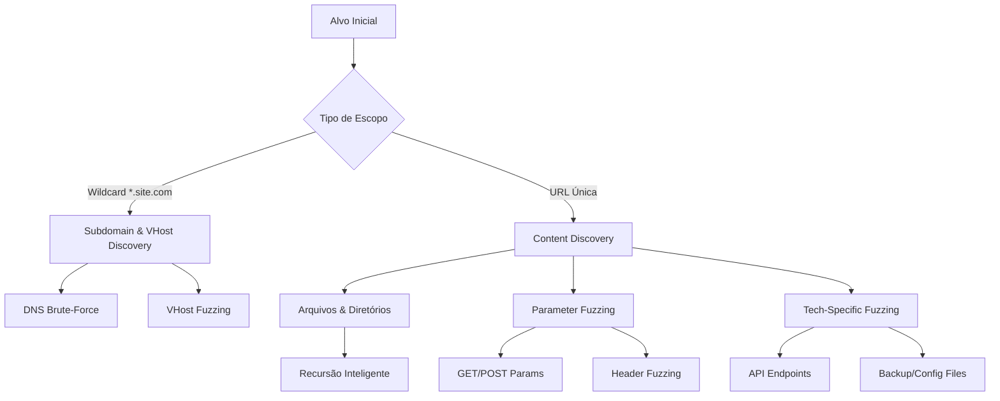

# Web Fuzzing

### 1. Virtual Host Discovery (Subdomínios)

O objetivo é encontrar subdomínios que estão hospedados no mesmo endereço IP (Virtual Hosting), manipulando o cabeçalho `Host`.

#### FFUF - VHost Fuzzing

Este comando injeta a wordlist na posição `FUZZ` dentro do cabeçalho `Host`.

```shellscript
ffuf -u http://hidden.fuzzing_fun.htb:53977/ \
     -w /usr/share/seclists/Discovery/Web-Content/common.txt \
     -H "Host: FUZZ.hidden.fuzzing_fun.htb" \
     -c -ac
```

* `-H "Host: FUZZ..."`: O segredo do VHost fuzzing. O servidor responde diferente dependendo do Host solicitado.
* `-ac` (Auto Calibrate): Crítico. O ffuf envia requisições aleatórias para entender o que é uma resposta "padrão/erro" e calibra os filtros automaticamente. Sem isso, você terá milhares de falsos positivos.
* `-c` (Color): Output colorido.

#### Gobuster - VHost Mode

Uma alternativa focada especificamente em VHosts.

```shellscript
gobuster vhost -u http://fuzzing_fun.htb:53977 \
               -w /usr/share/seclists/Discovery/Web-Content/common.txt \
               --append-domain
```

* `vhost`: Modo específico do Gobuster para virtual hosts (mais rápido que usar o modo `dir` para isso).
* `--append-domain`: Anexa automaticamente o domínio base à palavra da wordlist. Se a wordlist tem `admin`, ele testa `admin.fuzzing_fun.htb`.

***

### 2. Enumeração Recursiva de Diretórios

Ao invés de rodar o scan, encontrar uma pasta, e rodar outro scan manualmente, usamos a recursividade.

```shellscript
ffuf -u http://hidden.fuzzing_fun.htb:53977/godeep/FUZZ \
     -w /usr/share/seclists/Discovery/Web-Content/common.txt \
     -ic -recursion -recursion-depth 21 -rate 1000 -c -ac
```

* `-recursion`: Diz ao ffuf para escanear automaticamente subdiretórios encontrados.
* `-recursion-depth 21`: Define o quão profundo ele deve ir.
* `-rate 1000`: Define a velocidade (requisições por segundo).
  * _Nota:_ `1000` é agressivo. Em ambientes reais (não CTF), comece com 50-200 para não derrubar o servidor ou ser bloqueado por WAF.
* `-ic` (Ignore Comments): Ignora linhas comentadas na wordlist, evitando erros.

***

### 3. File Extension Discovery (Fuzzing de Arquivos)

Encontrar arquivos sensíveis ou páginas esquecidas pelos desenvolvedores.

```shellscript
ffuf -u http://83.136.251.11:53977/admin/FUZZ \
     -w /usr/share/seclists/Discovery/Web-Content/common.txt \
     -c -ac -e .php,.html,.txt,.bak,.js,.sql,.gz -v
```

* `-e .php,.html...`: A extensão mágica. O ffuf testará `palavra` e depois `palavra.php`, `palavra.txt`, etc.
  * _Dica:_ Sempre inclua `.bak` e `.old` para encontrar backups de arquivos de configuração.
* `-v` (Verbose): Mostra a URL completa no output (útil para clicar direto no terminal).

***

### 4. Parameter Fuzzing (GET)

Descobrir parâmetros ocultos que podem levar a IDOR, SQLi ou LFI.

```shellscript
ffuf -u http://83.136.251.11:53977/admin/panel.php\?accessID\=FUZZ \
     -w /usr/share/seclists/Discovery/Web-Content/common.txt \
     -c -ac
```

* `?accessID=FUZZ`: Aqui estamos fazendo _brute-force_ de valores para um parâmetro conhecido.
* _Cenário Alternativo:_ Para descobrir o nome do parâmetro, use `?FUZZ=value`.

***

### 5. Custom API Fuzzing (Python Scripting)

Quando as ferramentas padrão não conseguem lidar com a lógica de autenticação, encoding complexo ou flows específicos de API, usamos scripts.

```shellscript
python api_fuzzer.py http://83.136.251.11:53977
# Repo: https://github.com/PandaSt0rm/webfuzz_api.git
```

* Por que usar: Ferramentas como `ffuf` são ótimas, mas às vezes você precisa calcular um hash, assinar uma requisição JWT ou seguir um fluxo de 3 passos antes de fazer o fuzzing. Python (`requests` lib) é o padrão da indústria para isso.

***

### Pro Insights & Dicas de Mercado

#### 1. Use as Wordlists da Assetnote

Embora a `SecLists` seja o padrão clássico, as wordlists da [Assetnote](https://wordlists.assetnote.io/) são geradas estatisticamente a partir de scans massivos da internet. Elas são mais eficientes e modernas ("High signal, low noise").

* Dica: Substitua `common.txt` por [`httparchive_directories_1m_2020_11_18.txt`](https://wordlists-cdn.assetnote.io/data/automated/httparchive_directories_1m_2025_10_27.txt) da Assetnote para resultados melhores.

#### 2. Filtragem Granular (`-fc`, `-fs`, `-fl`)

O `-ac` é ótimo, mas às vezes falha. Aprenda a filtrar manualmente:

* `-fc 403,404`: Filter Code (esconde erros conhecidos).
* `-fs 1234`: Filter Size (muito útil quando todas as respostas 200 OK são uma página padrão de "Login", mas a página de admin tem um tamanho ligeiramente diferente).

#### 3. Output para Report (`-o`)

Nunca rode um scan longo sem salvar.

```shellscript
ffuf ... -o resultado.html -of html
# ou para processar depois com jq
ffuf ... -o resultado.json -of json
```

#### 4. Fuzzing via POST (JSON)

Muitas APIs modernas usam JSON. O ffuf lida com isso nativamente:

```shellscript
ffuf -u http://site.com/api/login -X POST \
     -H "Content-Type: application/json" \
     -d '{"user": "admin", "pass": "FUZZ"}' \
     -w passwords.txt
```

#### 5. WAF Evasion (Básico)

Se estiver sendo bloqueado (403) em tudo, tente reduzir a velocidade (`-p 0.1` - delay entre requisições) ou adicionar headers para parecer um navegador real (`-H "User-Agent: Mozilla/5.0..."`).

***

### The Mindmap (Fluxo de Pensamento)

Antes de rodar ferramentas, entenda onde você está no mapa:



***

### The Cheat Sheet (Comandos Aprimorados)

#### 1. VHost Discovery (O "Caçador de Subdomínios Ocultos")

Muitos servidores respondem com 200 OK para qualquer coisa. O segredo aqui é o filtro.

```shellscript
ffuf -u http://NODE_IP:PORT/ -H "Host: FUZZ.fuzzing_fun.htb" \
     -w /usr/share/seclists/Discovery/DNS/subdomains-top1million-110000.txt \
     -c -ac -mc 200,301,302,403 -fs 0
```

Pro Tips:

* `-ac`: Auto-calibrate. Essencial. O `ffuf` testa strings aleatórias antes de começar para "aprender" o que é lixo e ocultar automaticamente.
* Wordlist: Mudei para `subdomains-top1million`. A `common.txt` é para diretórios, não subdomínios.
* `-mc`: Match codes. Às vezes um 403 (Forbidden) em um subdomínio admin é mais valioso que um 200.

#### 2. Recursive Discovery (A "Varredura Profunda")

Ao invés de escanear, parar, e escanear de novo, use a automação.

```shellscript
ffuf -u http://NODE_IP:PORT/FUZZ \
     -w /usr/share/seclists/Discovery/Web-Content/raft-small-directories.txt \
     -recursion -recursion-depth 2 \
     -e .php,.txt,.bak,.json \
     -c -ac -t 200
```

Pro Tips:

* Wordlist: `raft-small-directories` ou `directory-list-2.3-medium` são muito superiores à `common.txt` para recursão.
* `-e .bak,.json`: Sempre procure por backups (`.bak`) e configs expostas (`.json`). É onde vivem as credenciais esquecidas.
* `-t 200`: Threads. 1000 (do seu comando original) é muito agressivo e pode derrubar a instância ou causar _rate-limit_ silencioso. 200 é o "sweet spot".

#### 3. Parameter Fuzzing (Em busca de IDOR e LFI)

A maioria esquece de fuzzar parâmetros. É aqui que os bug bounties altos vivem.

```shellscript
s# Descobrir parâmetros ocultos em um arquivo PHP
ffuf -u http://NODE_IP:PORT/admin/panel.php?FUZZ=key \
     -w /usr/share/seclists/Discovery/Web-Content/burp-parameter-names.txt \
     -c -ac -fs 1234
```

Pro Tips:

* Wordlist: `burp-parameter-names.txt` é a bíblia dos parâmetros.
* Valor de teste: Note o `?FUZZ=key`. Definir um valor ajuda a diferenciar respostas onde o parâmetro existe mas está vazio.

***

### "Million Dollar" Insights&#x20;

#### 1. Assetnote Wordlists > SecLists

Os profissionais estão migrando para as wordlists da Assetnote. Elas são geradas analisando toda a internet mensalmente. São mais atuais e geram menos lixo.

* _Link:_ `https://wordlists.assetnote.io/`

#### 2. A "Golden Extension" List

Nunca faça fuzzing cego de extensões. Use esta lista baseada na tecnologia do alvo:

* PHP/Apache: `.php`, `.php.bak`, `.php.old`, `.htaccess`, `.txt`
* IIS/ASP: `.asp`, `.aspx`, `.config`, `.bak`
* Node/Python: `.json`, `.yml`, `.js`
* Geral (Sempre use): `.zip`, `.tar.gz`, `.sql` (Backups de banco de dados).

#### 3. Fuzzing de API é diferente

Não use wordlists de diretórios em APIs. Use wordlists de objetos e ações.

* _Ex:_ `user`, `account`, `create`, `delete`, `v1`, `v2`, `internal`, `swagger`.
* O script Python (`api_fuzzer.py`) é ótimo para casos onde você precisa autenticar antes de cada request (ex: pegar um novo JWT a cada 10 requests).

#### 4. 403 Bypass Trick

Se achar um diretório `/admin` mas receber um 403 Forbidden, não desista.&#x20;

* Tente acessar `/admin/` (com a barra).
* Tente `/admin;.` (Bypass clássico de Tomcat/Java).
* Tente headers: `X-Custom-IP-Authorization: 127.0.0.1`.
