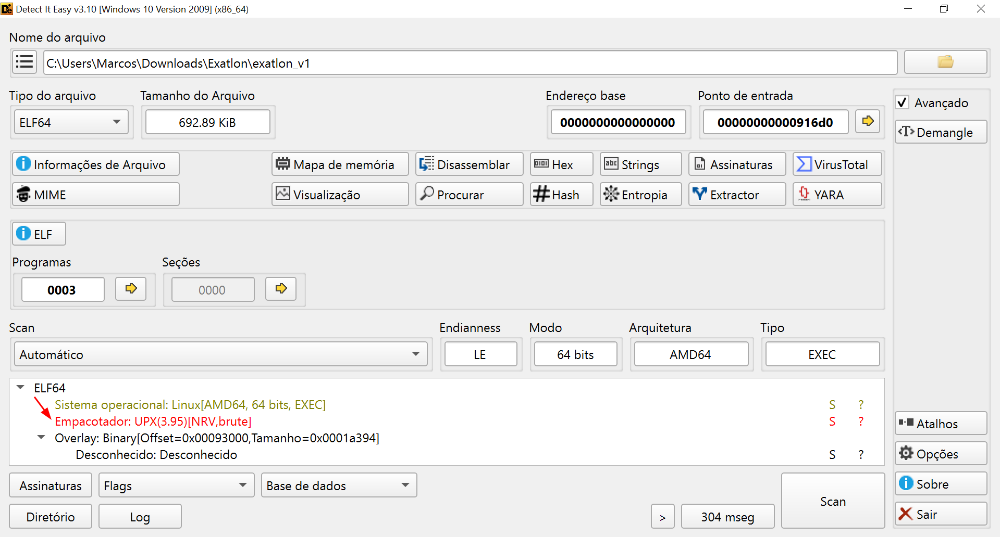

# Expressway

## 1. Escopo e objetivo

* **Máquina alvo:** `10.10.11.87`&#x20;
* DNS: `expressway.htb`
* **Objetivo:** obter os dois arquivos de flag; `user.txt` (usuário) e `root.txt` (root)
* **Metodologia:** Reconhecimento → Enumeração → Acesso inicial → Escalada de privilégio → Pós-exploração

***

## 2. Reconhecimento e enumeração&#x20;

### 2.1 Porta TCP rápida

<figure><figcaption></figcaption></figure>

<figure><figcaption></figcaption></figure>

```bash
rustscan -a 10.10.11.87 -- -sVC
```

* Resultado: somente **22/tcp (SSH)** aberta.
* **Porquê esse scan?** RustScan rapidamente detecta as portas TCP mais comuns e integra com nmap para detecção de versão (`-sVC`).
* **O que isso nos diz?** Um serviço SSH está ativo, mas um único serviço TCP superficialmente indica pouco vetor direto além SSH; precisamos olhar para UDP ou serviços menos visíveis.

### 2.2 Scan UDP para portas comuns

<figure><figcaption></figcaption></figure>

```bash
nmap -sU 10.10.11.87 --top-ports 50
```

* Resultado: **500/udp** aparece como aberta.
* **Porquê?** Muitos pentesters ignoram UDP, mas protocolos críticos de infraestrutura (VPNs, IPsec) usam UDP (ex: porta 500 para IKE). Encontrar 500/udp sugere “há um endpoint VPN ou IPsec/IKE”.
* **O que fazer agora?** Investigar o protocolo que roda na porta 500/udp — pesquisa rápida indica que IKE (Internet Key Exchange) teoricamente usa UDP 500. Pesquisas online confirmam: ([Hacktricks](https://book.hacktricks.wiki/en/network-services-pentesting/ipsec-ike-vpn-pentesting.html))

### 2.3 Pesquisa e decisão de ferramenta

<figure><figcaption></figcaption></figure>

* Pesquisa “500/udp ipsec ike pentesting” ou “IKE aggressive mode PSK crack” leva a artigos como: ([ERNW - PSK Attack](https://ernw.de/download/pskattack.pdf) e [IPSec / IKE VPN - Port 500/udp](https://www.verylazytech.com/network-pentesting/ipsec-ike-vpn-port-500-udp))

<figure><figcaption></figcaption></figure>

* **Conclusão técnica:** Se um endpoint IKEv1 suporta _Aggressive Mode_ com _PSK_ (pre-shared key), então é possível capturar um hash do PSK (transmitido sem encriptação no modo Aggressive) e quebrá-lo offline. ([Information Security Stack Exchange](https://security.stackexchange.com/questions/76444/what-are-the-practical-risks-of-using-ike-aggressive-mode-with-a-pre-shared-key?utm_source=chatgpt.com))
* **Ferramenta adequada:** `ike-scan` (e `psk-crack`); documentação oficial do Kali lista exatamente isso. ([Kali Linux](https://www.kali.org/tools/ike-scan/?utm_source=chatgpt.com))
* **Raciocínio:** Porta 500/udp → suspeita IKE/IPsec → verificar se exposição vulnerável (Aggressive Mode + PSK) → usar ferramenta para extrair hash → quebrar.

### 2.4 Enumeração IKE agressivo

<figure><figcaption></figcaption></figure>

```bash
ike-scan -A --pskcrack=hash.txt 10.10.11.87
```

* `-A` = Aggressive mode scan
* `--pskcrack=hash.txt` = crack da pre-shared key no aggressive mode

<figure><figcaption></figcaption></figure>

* Saída mostra: “Aggressive Mode Handshake returned HDR=…, SA=(Enc=3DES Hash=SHA1 Group=2:modp1024 Auth=PSK …) ID(Type=ID\_USER\_FQDN, Value=ike@expressway.htb) …” e salva o hash no arquivo.

<figure><figcaption></figcaption></figure>

* **Interpretação:** O gateway responde usando PSK autenticação, indica modo Aggressive ativo. A ID devolvida corresponde ao formato user/service. A presença de hash indica que a configuração é vulnerável.
* **Raciocínio encadeado:** Identificar que o serviço permite Aggressive Mode → extrair hash PSK → preparar para crack.

***

## 3. Cracking do PSK e acesso

### 3.1 Quebra de PSK

<figure><figcaption></figcaption></figure>

```bash
psk-crack -d /usr/share/wordlists/rockyou.txt hash.txt
```

* Usamos `rockyou.txt` como wordlist (comum em CTFs). Resultado encontrado: `freakingrockstarontheroad`.
* **Porquê usar wordlist?** Porque PSK vulnerável muitas vezes é fraca/humana ou repetida. A fonte article confirma que modo agressivo permite “offline dictionary/brute-force” da PSK. ([Raxis](https://raxis.com/blog/ike-vpns-supporting-aggressive-mode/?utm_source=chatgpt.com))
* **Raciocínio:** Hash foi extraído → agora quebramos offline → obtivemos PSK.

### 3.2 Login SSH com credencial derivada

<figure><figcaption></figcaption></figure>

```bash
ssh ike@expressway.htb
```

* A identidade usada no handshake “[ike@expressway.htb](mailto:ike@expressway.htb)” foi utilizada como username.
* Conseguimos shell como `ike`. Em home: `cat user.txt` → flag user.
* **Porquê isso funciona?** Em lab/CTF o autor mapeou uma identidade de VPN (IKE) para conta local de SSH, muito didático.
* **Raciocínio:** PSK agora funciona como senha → entrar via SSH → obter acesso inicial.

***

## 4. Escalada de privilégios

<figure><figcaption></figcaption></figure>

Após acessar a maquina via ssh, rodamos o script de enumeração mais conhecido e usado em CTFs, em sua versão para linux: [linpeas.sh](https://github.com/peass-ng/PEASS-ng/tree/master/linPEAS).

<figure><figcaption></figcaption></figure>

<figure><figcaption></figcaption></figure>

### 4.1 Verificação ambiente

* User `ike` no sistema Debian 6.16.7-1 x86\_64. Kernel antigo.
* Verificar `uname -a`, `sudo -l`, ver pacotes SUID, versões.
* **Motivo:** Escalada local muitas vezes depende de vulnerabilidades no kernel, nos utilitários SUID (ex: sudo), nas permissões incorretas.

### 4.2 Vulnerabilidade descoberta: CVE-2025-32463

<figure><figcaption></figcaption></figure>

* Script `CVE-2025-32463.sh` usado e executado com sucesso para obter root ([Link](https://www.upwind.io/feed/cve%E2%80%912025%E2%80%9132463-critical-sudo-chroot-privilege-escalation-flaw)).
* Exploit traduzido: Explora `sudo --chroot` vulnerável para ganhar root.
* **Raciocínio:** Ver ambiente vulnerável → pesquisar CVE correspondente → aplicar exploit.

### 4.3 Execução

<figure><figcaption></figcaption></figure>

```bash
./CVE-2025-32463.sh
id
cat /root/root.txt
```

* Resultado: root conseguido.
* **Raciocínio final:** Temos root → Flag owned!.

***

## 5. Lições aprendidas e boas práticas

### 5.1 Técnicas chave

* Nunca ignore UDP ou portas “estranhas” — como 500/udp para IKE/IPsec.
* Se encontrar IKEv1 com modo Aggressive + PSK, alta chance de comprometimento offline. Fontes mostram que essa falha é conhecida há anos. ([Raxis](https://raxis.com/blog/ike-vpns-supporting-aggressive-mode/?utm_source=chatgpt.com))
* Use `ike-scan` + `psk-crack` como padrão para esse tipo de serviço.
* Mapear identidades de VPN para contas SSH pode levar a acesso rápido.
* Verificar escalada local: utilitários comuns (sudo, chroot) ainda têm falhas exploitáveis.

### 5.2 Mitigações para defender

* Desabilitar modo Aggressive em IKE; usar Main Mode ou IKEv2 com certificados. ([Very Lazy Tech](https://www.verylazytech.com/network-pentesting/ipsec-ike-vpn-port-500-udp?utm_source=chatgpt.com))
* Usar PSKs fortes, grande entropia, ou melhor ainda: certificados.
* Restringir acesso à conta de VPN — não mapear diretamente para SSH ou shell.
* Manter sistema e utilitários atualizados (patch sudo e kernel).
* Monitorar logs para tentativas de IKE agressivo, hash extrações, e uso de `sudo --chroot`.

